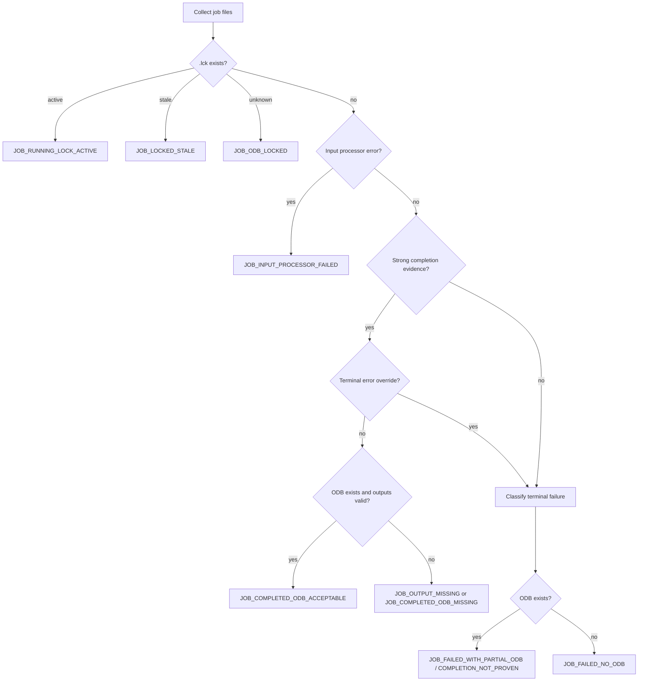

# AbqPilot Abaqus Job / ODB Diagnosis Taxonomy

> Engineering-grade classification system for automated Abaqus/Standard job-status diagnosis, ODB acceptability gating, and downstream metrics-extraction safety.

版本：`v1.0`  
适用范围：`Abaqus/Standard`  
建议位置：`docs/architecture/ABQPILOT_ABAQUS_JOB_ODB_DIAGNOSIS_TAXONOMY.md`  
用途：开发者规格文档 / Agent prompt 输入 / Parser 与状态机实现基准 / CI job-health check 规则

---

## 0. 最高结论

**ODB 文件存在不等于 Abaqus job 成功完成。**

Abaqus/Standard 会在每个成功收敛的 increment 结束时增量式写入 `.odb`。因此，即使后续 increment 因收敛失败、数值失稳、输入错误或系统错误而终止，`.odb` 仍可能存在，并保留到最后一个已写入 frame。

结论很明确：

```text
Only an ODB proven by completion evidence is acceptable for metrics extraction.
```

## Stage 4.1B Implementation Note

When an abqjobpilot execution record exists, AbqPilot should prefer that structured record as the execution lifecycle and file-path authority. The record may provide `job_id`, `status`, `job_name`, `inp_path`, `work_dir`, `.sta/.msg/.dat/.log/.odb` paths, `fatal_reason`, and `return_code`. AbqPilot then applies this taxonomy to the referenced files read-only. abqjobpilot remains the queue/runner lifecycle authority; AbqPilot remains the ODB validity, deterministic failure diagnosis, and repair-proposal authority. ODB existence alone remains insufficient for metrics extraction.

在 AbqPilot 中，ODB 读取必须被放在一个严格的 **ODB acceptability gate** 后面。任何 partial ODB、locked ODB、completion-not-proven ODB，都不能进入最终 metrics extraction，更不能进入 paper-grade evidence freeze。

---

## 1. Design Goal

本 Taxonomy 用于实现 AbqPilot 的 Abaqus job 诊断模块：

```text
Abaqus job directory
→ parse .sta / .dat / .msg / .log / .lck / .odb
→ classify job state
→ determine ODB acceptability
→ block or allow metrics extraction
→ emit structured diagnosis JSON
```

该模块不负责修改模型，也不负责自动修复。它只负责给出可信诊断：

```text
PASS: ODB acceptable for metrics
BLOCK: ODB exists but cannot be trusted
FAIL: job failed with classified reason
UNKNOWN: evidence insufficient
```

---

## 2. Evidence Priority

Job 成功与否必须综合多源证据判断。推荐优先级如下。

| Priority | File / Signal | Role | Main Use |
|---:|---|---|---|
| 1 | `.sta` | 最权威状态文件 | 判断 step / increment 进度、completion、termination |
| 2 | `.dat` | 输入处理与求解摘要 | 判断 input processor error、keyword / set / output request 问题 |
| 3 | `.msg` | 最详细 solver 日志 | 判断 convergence、residual、contact、material integration、distortion |
| 4 | `.log` | 高层执行流 | 判断 license、preprocessor、solver 启动/退出、system error |
| 5 | `.lck` | ODB 写锁 | 判断 job active、ODB locked、stale lock |
| 6 | `.odb` | 二进制结果文件 | 只用于存在性、大小和后续受控读取；不能单独证明成功 |
| 7 | Return code | 进程返回码 | 辅助信号；不能替代日志证据 |

核心规则：

```text
Terminal error evidence overrides weak success evidence.
ODB existence is auxiliary evidence only.
Completion string + no terminal error + no active lock is required.
```

---

## 3. Core Completion and Error Patterns

### 3.1 Strong Success Pattern

首选在 `.sta` 中查找：

```text
THE ANALYSIS HAS COMPLETED SUCCESSFULLY
```

可作为补充在 `.dat` / `.msg` 中查找同一完成字符串。

### 3.2 Terminal Failure Patterns

以下模式一旦出现，应优先触发失败或阻塞：

```text
THE ANALYSIS HAS NOT BEEN COMPLETED
ANALYSIS TERMINATED
Abaqus Error
Analysis Input File Processor exited with an error
Abaqus/Standard Analysis exited with an error
***ERROR
exited with an error
```

实现建议：

```text
- 对固定 Abaqus 字符串保持大小写敏感匹配。
- 对 common observed pattern 可使用大小写不敏感正则。
- 重点扫描文件尾部，但不要只扫描尾部；input processor error 可能出现在 .dat/.log 前段。
```

---

## 4. ODB Acceptability Rules

ODB 仅在同时满足以下条件时，才允许进入 metrics extraction：

```text
[ ] ODB 文件存在。
[ ] ODB 文件非空，且大小超过最低合理阈值。
[ ] 无 active .lck。
[ ] .sta 优先存在强完成证据：THE ANALYSIS HAS COMPLETED SUCCESSFULLY。
[ ] 无终端错误覆盖：***ERROR / exited with an error / ANALYSIS TERMINATED。
[ ] Final step / final increment 完成证据充分。
[ ] 请求的输出变量已被请求并应当写入，例如 U / NT11 / S / PEEQ。
[ ] Job 未因 input / convergence / numerical / material / contact / environment error 提前终止。
```

特别规则：

```text
ODB exists + no completion proof = metrics extraction blocked.
ODB exists + terminal error = partial ODB, metrics extraction blocked.
.lck exists + active job evidence = running, metrics extraction blocked.
.lck exists + stale evidence = require safe stale-lock handling before extraction.
```

---

## 5. Failure Taxonomy

### A. Input File Processor / Pre-processing Failure

发生阶段：求解前，input processor / preprocessor 阶段。  
ODB 状态：通常不存在，或极小、无效。  
AbqPilot 处理：不进入 solver-level ODB 判断；直接分类为 input failure。

典型模式：

```text
Analysis Input File Processor exited with an error
Abaqus Error
Unknown assembly set
Unknown part instance
Unknown node set
Unknown element set
Missing data
The keyword is misplaced
This keyword is not available
***ERROR
```

常见根因：

```text
- *INCLUDE 文件缺失或路径错误
- set / surface / instance 未定义
- material / section / step 引用错误
- boundary / load 引用不存在 region
- Abaqus keyword 位置错误
- 逗号、引号、续行格式错误
```

---

### B. Solver Convergence Failure

发生阶段：Newton-Raphson / severe discontinuity iteration / nonlinear solving。  
ODB 状态：可能存在 partial ODB，但不可用于最终 metrics。  
AbqPilot 处理：阻塞 ODB extraction，记录 failure step / increment。

典型模式：

```text
Too many attempts made for this increment
ANALYSIS TERMINATED
contact convergence failure
severe discontinuity iterations too many
```

常见根因：

```text
- 增量设置过激
- 接触状态剧烈变化
- 非线性材料曲线不平滑
- 热-力耦合刚性过强
- load ramping 太陡
```

---

### C. Numerical Instability / Divergence

发生阶段：求解阶段。  
ODB 状态：可能存在，但结果通常不可信。  
AbqPilot 处理：阻塞 metrics，优先归类为 numerical instability。

典型模式：

```text
excessive distortion at a total of ... integration points in solid continuum elements
zero pivot
negative eigenvalues
Abaqus system matrix has negative eigenvalues
singular matrix
ill-conditioned stiffness matrix
rigid body motion
```

常见根因：

```text
- 约束不足导致刚体运动
- 刚度矩阵病态
- 材料软化或负刚度效应
- 局部变形过大
- 接触/约束冲突诱发数值发散
```

---

### D. Element / Mesh Related Failure

发生阶段：输入检查或运行时。  
ODB 状态：运行时失败可能生成 partial ODB。  
AbqPilot 处理：优先定位 element ID 与区域。

典型模式：

```text
excessive element distortion
excessive distortion
badly shaped elements
negative volume
hourglass
incompatible element formulation
```

常见根因：

```text
- 局部网格质量差
- 单元尺寸与变形量级不匹配
- 单元类型不适合当前物理问题
- 过强热载荷或接触导致单元严重畸变
```

---

### E. Contact / Constraint Failure

发生阶段：输入检查或 nonlinear solver。  
ODB 状态：可能生成 partial ODB。  
AbqPilot 处理：归类为 contact / constraint，保留 contact status 摘要。

典型模式：

```text
initial overclosure
severe discontinuity iterations
CONTACT ITERATION DID NOT CONVERGE
CONTACT COUPLING FAILED
duplicate constraints
inconsistent coupling
rigid body constraints conflict
```

常见根因：

```text
- 初始过闭合
- tied / coupling 定义不一致
- 重复约束
- 接触状态频繁 open/close 切换
- general contact 或 contact pair 设置不合理
```

---

### F. Material / Constitutive Model Failure

发生阶段：输入处理或材料积分阶段。  
ODB 状态：运行时失败可能生成 partial ODB。  
AbqPilot 处理：归类为 material model failure。

典型模式：

```text
invalid plastic data
negative plastic strain increment
Material property out of range
USER SUBROUTINE UMAT aborted
VUMAT aborted
```

常见根因：

```text
- 塑性数据非单调
- temperature-dependent material data 缺失
- 材料参数超出定义范围
- UMAT / VUMAT 内部异常终止
- 损伤 / 软化模型导致积分失败
```

---

### G. Thermal / Coupled Thermal-Mechanical Failure

发生阶段：热分析或 coupled temp-displacement 分析。  
ODB 状态：可能不存在，也可能 partial。  
AbqPilot 处理：归类为 thermal / coupling 子类，必要时同时标记 convergence。

典型模式：

```text
temperature DOF issue
heat flux region issue
thermal boundary condition problem
thermal step increment issue
coupled temp-displacement convergence issue
missing NT11 output
```

常见根因：

```text
- 热流 region 定义错误
- 温度自由度 / 输出请求缺失
- 热边界条件不完整
- coupled step 增量设置不合理
- 热-力耦合非线性过强
```

---

### H. Output / ODB / Post-processing Failure

发生阶段：分析完成后或结果读取阶段。  
ODB 状态：可能 missing、locked、corrupted、field missing。  
AbqPilot 处理：即使 job 完成，也必须阻塞缺失变量的 metrics。

典型状态：

```text
ODB missing
ODB locked
ODB corrupted
ODB created but analysis failed
No requested field output
Missing final frame
Missing variable: NT11 / S / PEEQ / U
```

关键规则：

```text
Completed job + missing requested field = JOB_OUTPUT_MISSING.
Failed job + ODB exists = JOB_FAILED_WITH_PARTIAL_ODB.
ODB locked = JOB_ODB_LOCKED or JOB_RUNNING_LOCK_ACTIVE.
```

---

### I. License / Environment / Execution Failure

发生阶段：启动、license checkout、子程序编译、系统资源阶段。  
ODB 状态：通常不存在或无效。  
AbqPilot 处理：分类为 environment failure，不应误判为模型物理失败。

典型模式：

```text
license checkout failure
FLEXlm
LM_LICENSE_FILE
compiler environment issue
user subroutine compiler error
working directory permission
path too long
file locked
insufficient disk
memory allocation failure
system error code
```

常见根因：

```text
- 许可证不可用
- Fortran 编译环境错误
- 工作目录权限不足
- 路径过长
- 磁盘或内存不足
- 文件被其他进程占用
```

---

## 6. Job State Classification

推荐 AbqPilot 使用以下稳定枚举作为状态机输出。

```text
JOB_COMPLETED_ODB_ACCEPTABLE
JOB_FAILED_WITH_PARTIAL_ODB
JOB_FAILED_NO_ODB
JOB_INPUT_PROCESSOR_FAILED
JOB_SOLVER_CONVERGENCE_FAILED
JOB_NUMERICAL_INSTABILITY_FAILED
JOB_MESH_DISTORTION_FAILED
JOB_CONTACT_CONSTRAINT_FAILED
JOB_MATERIAL_MODEL_FAILED
JOB_THERMAL_COUPLING_FAILED
JOB_OUTPUT_MISSING
JOB_ODB_LOCKED
JOB_RUNNING_LOCK_ACTIVE
JOB_LOCKED_STALE
JOB_COMPLETED_ODB_MISSING
JOB_ODB_EXISTS_BUT_COMPLETION_NOT_PROVEN
JOB_LICENSE_OR_ENVIRONMENT_FAILED
JOB_STATUS_UNKNOWN
```

### 6.1 State Semantics

| State | Meaning | Metrics Extraction |
|---|---|---|
| `JOB_COMPLETED_ODB_ACCEPTABLE` | 完成证据充分，ODB 可接受 | Allow |
| `JOB_FAILED_WITH_PARTIAL_ODB` | Job 失败但 ODB 存在 | Block |
| `JOB_FAILED_NO_ODB` | Job 失败且 ODB 不存在或无效 | Block |
| `JOB_INPUT_PROCESSOR_FAILED` | 输入处理器早期失败 | Block |
| `JOB_SOLVER_CONVERGENCE_FAILED` | 主导原因是 increment attempts 耗尽 | Block |
| `JOB_NUMERICAL_INSTABILITY_FAILED` | 主导原因是 zero pivot / negative eigenvalues / singularity | Block |
| `JOB_MESH_DISTORTION_FAILED` | 主导原因是 element distortion / negative volume | Block |
| `JOB_CONTACT_CONSTRAINT_FAILED` | 主导原因是 contact / constraint | Block |
| `JOB_MATERIAL_MODEL_FAILED` | 主导原因是 material data / constitutive integration | Block |
| `JOB_THERMAL_COUPLING_FAILED` | 主导原因是 thermal / coupled temp-displacement | Block |
| `JOB_OUTPUT_MISSING` | Job 完成但缺失 final frame 或变量 | Block partial metrics; allow only explicit diagnostic extraction |
| `JOB_ODB_LOCKED` | ODB 锁存在，active/stale 未明 | Block |
| `JOB_RUNNING_LOCK_ACTIVE` | Job 仍在运行或 ODB 正在写入 | Block |
| `JOB_LOCKED_STALE` | 锁文件残留，需要安全清理 | Block until resolved |
| `JOB_COMPLETED_ODB_MISSING` | 完成字符串存在但 ODB 缺失 | Block |
| `JOB_ODB_EXISTS_BUT_COMPLETION_NOT_PROVEN` | ODB 存在但 completion 未证明 | Block |
| `JOB_LICENSE_OR_ENVIRONMENT_FAILED` | 许可证、编译、路径、资源错误 | Block |
| `JOB_STATUS_UNKNOWN` | 证据不完整或模式未匹配 | Block by default |

---

## 7. Diagnosis Decision Tree

推荐按以下顺序执行判断，避免被 partial ODB 误导。

```text
1. Collect files
   - .sta / .dat / .msg / .log / .lck / .odb
   - size, mtime, existence, tail excerpts

2. Check lock
   - .lck exists + .sta active progress → JOB_RUNNING_LOCK_ACTIVE
   - .lck exists + termination/completion older than threshold → JOB_LOCKED_STALE
   - .lck exists + unknown evidence → JOB_ODB_LOCKED

3. Check input processor failure
   - Analysis Input File Processor exited with an error
   - keyword / set / instance / include / missing data errors
   → JOB_INPUT_PROCESSOR_FAILED

4. Check strong completion evidence
   - THE ANALYSIS HAS COMPLETED SUCCESSFULLY in .sta preferred
   - no terminal error override
   - ODB exists and non-empty
   → candidate JOB_COMPLETED_ODB_ACCEPTABLE

5. Check terminal error evidence
   - ***ERROR
   - Abaqus Error
   - ANALYSIS TERMINATED
   - exited with an error

6. Classify dominant failure category
   - numerical instability > mesh distortion > convergence > contact/constraint > material > thermal > environment > generic failure

7. Check ODB acceptability
   - ODB missing → JOB_FAILED_NO_ODB or JOB_COMPLETED_ODB_MISSING
   - ODB exists but completion not proven → JOB_ODB_EXISTS_BUT_COMPLETION_NOT_PROVEN
   - ODB exists with terminal error → JOB_FAILED_WITH_PARTIAL_ODB

8. Emit diagnosis JSON
   - diagnosis_status
   - odb_acceptable_for_metrics
   - failure_category
   - blocked_reason
   - important_error_lines
   - recommended_next_action
```

Mermaid 版本：



---

## 8. Log Pattern Library

### 8.1 `.sta`

主要用途：completion、termination、step/increment progress。

```text
THE ANALYSIS HAS COMPLETED SUCCESSFULLY
ANALYSIS TERMINATED
Step
Increment
```

实现建议：

```text
- 优先读取最后 50-200 行。
- 提取 last_step_from_sta、last_increment_from_sta、last_time_from_sta。
- 若 .sta 持续更新且 .lck 存在，判断为 active running。
```

### 8.2 `.dat`

主要用途：input processor、keyword、set/surface/instance、output request。

```text
THE ANALYSIS HAS COMPLETED SUCCESSFULLY
***ERROR
Abaqus Error:
Analysis Input File Processor exited with an error
Unknown assembly set
Unknown node set
Unknown element set
Missing data
The keyword is misplaced
This keyword is not available
```

### 8.3 `.msg`

主要用途：solver convergence、residual、contact、material、distortion、negative eigenvalues。

```text
Too many attempts made for this increment
The solution has converged
negative plastic strain increment
contact status
severe discontinuity iterations
excessive distortion
negative eigenvalues
zero pivot
```

### 8.4 `.log`

主要用途：license、environment、subroutine compilation、preprocessor/solver status。

```text
license checkout
FLEXlm
LM_LICENSE_FILE
compiler
Analysis Input File Processor exited with an error
Abaqus/Standard Analysis exited with an error
system error code
```

### 8.5 `.lck`

主要用途：判断 ODB 是否可读。

```text
active lock = job running or ODB being written
stale lock = job already completed/terminated but lock remains
```

判断建议：

```text
- 对比 .lck mtime 与 .sta/.dat/.msg mtime。
- 检查是否存在 Abaqus 进程。
- 只有确认 stale 后才允许安全移除。
- 未确认前一律阻塞 metrics extraction。
```

---

## 9. Recommended Diagnosis JSON Schema

推荐输出文件：

```text
solver_diagnosis.json
```

示例结构：

```json
{
  "job_name": "...",
  "job_dir": "...",
  "diagnosis_timestamp": "...",
  "diagnosis_status": "JOB_COMPLETED_ODB_ACCEPTABLE",
  "odb_acceptable_for_metrics": true,
  "odb_exists": true,
  "odb_size_bytes": 123456,
  "lock_exists": false,
  "lock_is_stale": false,
  "sta_exists": true,
  "dat_exists": true,
  "msg_exists": true,
  "log_exists": true,
  "input_processor_error": false,
  "solver_started": true,
  "analysis_completed": true,
  "analysis_not_completed": false,
  "completed_line_found": true,
  "completed_line_file": "sta",
  "error_lines_found": false,
  "warning_lines_found": true,
  "error_count": 0,
  "warning_count": 12,
  "failure_category": null,
  "failure_step": null,
  "failure_increment": null,
  "termination_reason": null,
  "important_error_lines": [],
  "important_warning_lines": ["..."],
  "key_excerpts_from_msg": [],
  "last_step_from_sta": "Step-1",
  "last_increment_from_sta": "Increment 120",
  "partial_results_available": false,
  "metrics_extraction_blocked_reason": null,
  "recommended_next_action": "Proceed to controlled ODB metrics extraction.",
  "raw_files_summary": {
    "sta_path": "...",
    "dat_path": "...",
    "msg_path": "...",
    "log_path": "...",
    "odb_path": "...",
    "lck_path": null
  }
}
```

### 9.1 Required Fields

```text
job_name
job_dir
diagnosis_timestamp
diagnosis_status
odb_acceptable_for_metrics
odb_exists
lock_exists
sta_exists
dat_exists
msg_exists
log_exists
analysis_completed
completed_line_found
error_lines_found
failure_category
termination_reason
important_error_lines
metrics_extraction_blocked_reason
recommended_next_action
raw_files_summary
```

### 9.2 Failure Category Enum

```text
input_processor
solver_convergence
numerical_instability
mesh_distortion
contact_constraint
material_model
thermal_coupling
output_missing
odb_locked
license_or_environment
unknown
```

---

## 10. Recommended Actions by Failure Type

本节仅给出诊断建议。AbqPilot 不应在该模块中直接修改模型。

| Failure Type | Recommended Next Action |
|---|---|
| Input processor failure | 检查 `.dat` 中 keyword / set / instance / section 引用错误；验证 include 路径；确认 BC/load region 已定义。 |
| Solver convergence failure | 检查失败 step/increment 的增量设置、contact status、材料曲线平滑度、load ramping、automatic stabilization。 |
| Numerical instability | 检查 zero pivot / negative eigenvalues 位置；排查刚体运动、约束不足、病态刚度矩阵。 |
| Mesh distortion | 定位 `.msg` 中 element ID；检查网格质量、单元尺寸、局部变形量级、材料软化。 |
| Contact / constraint failure | 检查 overclosure、重复约束、tied/coupling 一致性、contact pair/general contact 设置。 |
| Material model failure | 检查塑性/损伤数据单调性、温度依赖数据范围、UMAT/VUMAT 参数和编译日志。 |
| Thermal / coupled failure | 检查温度 DOF、NT11 输出请求、热流 region、thermal boundary、coupled step increment。 |
| Output / ODB missing | 检查 output request，确认 U/S/PEEQ/NT11 是否在 final step 请求；完成证据不足时禁止提取。 |
| ODB locked | active 则等待或检查进程；stale 则在确认无 Abaqus 进程后安全处理。 |
| License / environment | 检查 license server、LM_LICENSE_FILE、Fortran 编译环境、磁盘、权限、路径长度。 |
| Unknown | 输出证据摘要，阻塞 metrics，要求人工 review 或补充日志文件。 |

---

## 11. AbqPilot Integration Contract

### 11.1 Module Name

建议模块：

```text
abqpilot/solver/solver_diagnosis.py
```

或：

```text
abqpilot/tools/job_diagnosis.py
```

### 11.2 CLI Command

建议 CLI：

```bash
python -m abqpilot.cli diagnose-job --job-dir <JOB_DIR> --job-name <JOB_NAME>
```

### 11.3 Input Contract

```json
{
  "job_name": "sanity_base_01",
  "job_dir": "runs/.../iteration_001",
  "expected_odb": "runs/.../iteration_001/sanity_base_01.odb",
  "expected_fields": ["U", "NT11", "S", "PEEQ"],
  "stale_lock_seconds": 3600,
  "allow_stale_lock_cleanup": false
}
```

### 11.4 Output Contract

```text
solver_diagnosis.json
job_status.json
trace.md
```

### 11.5 Downstream Rule

ODB extractor must check:

```python
if diagnosis["diagnosis_status"] != "JOB_COMPLETED_ODB_ACCEPTABLE":
    raise MetricsExtractionBlocked(diagnosis["metrics_extraction_blocked_reason"])
```

No downstream module may bypass this rule.

---

## 12. Implementation Checklist

```text
[ ] Implement file discovery for .sta/.dat/.msg/.log/.odb/.lck.
[ ] Implement tail and full-file scanning strategy.
[ ] Implement pattern library as YAML or Python constants.
[ ] Implement completion evidence detector.
[ ] Implement terminal error detector.
[ ] Implement lock classifier: active / stale / unknown.
[ ] Implement ODB existence and size checks.
[ ] Implement dominant failure classifier.
[ ] Implement metrics extraction blocking reason.
[ ] Emit solver_diagnosis.json.
[ ] Add unit tests for each job state enum.
[ ] Add fixture logs for input failure, convergence failure, partial ODB, locked ODB, and successful completion.
[ ] Make ODB extractor depend on diagnosis_status.
[ ] Add final report section summarizing job diagnosis.
```

---

## 13. Test Fixture Design

建议为每个状态构造最小日志样本。

```text
tests/fixtures/job_diagnosis/
├── completed_success/
│   ├── job.sta
│   ├── job.dat
│   ├── job.msg
│   ├── job.log
│   └── job.odb.mock
├── input_processor_failed/
├── convergence_failed_partial_odb/
├── numerical_instability_failed/
├── mesh_distortion_failed/
├── contact_constraint_failed/
├── material_model_failed/
├── thermal_coupling_failed/
├── output_missing/
├── odb_locked_active/
├── odb_locked_stale/
├── completed_odb_missing/
└── environment_failed/
```

最低测试要求：

```text
- completed success → JOB_COMPLETED_ODB_ACCEPTABLE, odb_acceptable_for_metrics=true
- partial ODB → JOB_FAILED_WITH_PARTIAL_ODB, odb_acceptable_for_metrics=false
- ODB exists without completion → JOB_ODB_EXISTS_BUT_COMPLETION_NOT_PROVEN
- active .lck → JOB_RUNNING_LOCK_ACTIVE
- stale .lck → JOB_LOCKED_STALE
- input processor error → JOB_INPUT_PROCESSOR_FAILED
- too many attempts → JOB_SOLVER_CONVERGENCE_FAILED
- zero pivot / negative eigenvalues → JOB_NUMERICAL_INSTABILITY_FAILED
```

---

## 14. Non-Negotiable Safety Rules

```text
1. Do not read ODB metrics unless job completion is proven.
2. Do not treat ODB existence as success evidence.
3. Do not ignore .lck.
4. Do not silently accept partial ODB.
5. Do not let LLM override solver_diagnosis.json.
6. Do not freeze paper-grade evidence from failed or completion-not-proven jobs.
7. Do not classify environment failure as model physics failure.
8. Do not delete stale lock files without explicit safety confirmation.
```

---

## 15. Final Policy Statement

AbqPilot 的 job diagnosis 模块必须先证明 job 完成，再允许 ODB metrics extraction。

最终判定规则：

```text
No proven completion, no trusted metrics.
No trusted metrics, no repair decision.
No repair decision, no evidence freeze.
```

这条规则是 AbqPilot 从“能跑脚本”走向“可信闭环仿真 agent”的关键边界。
